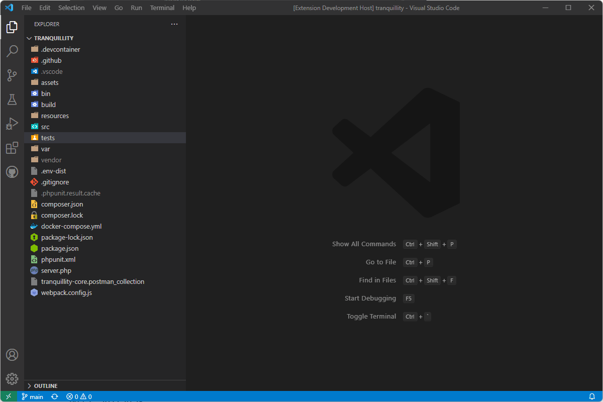
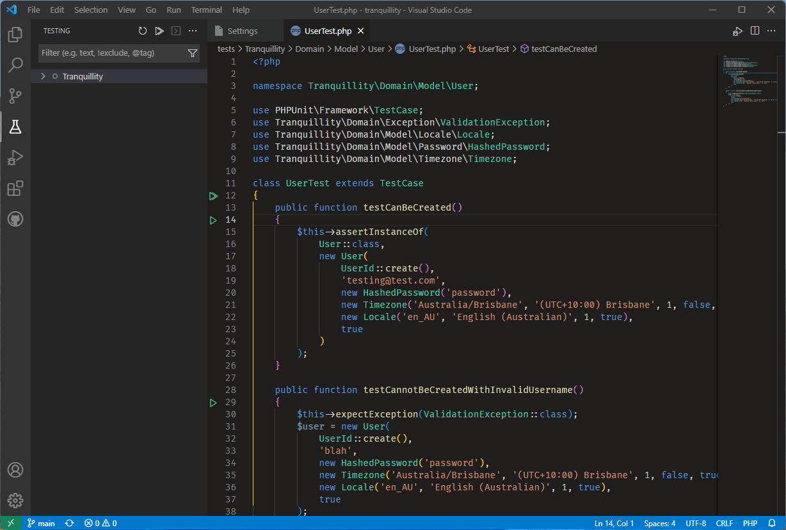
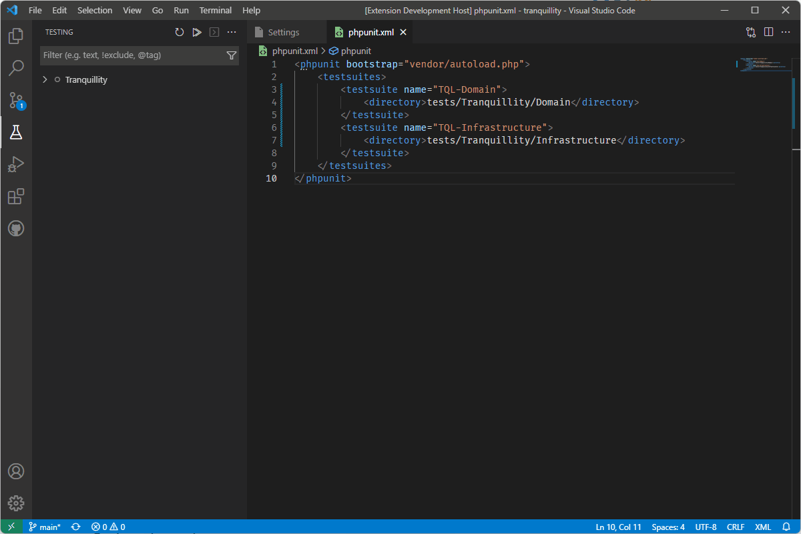
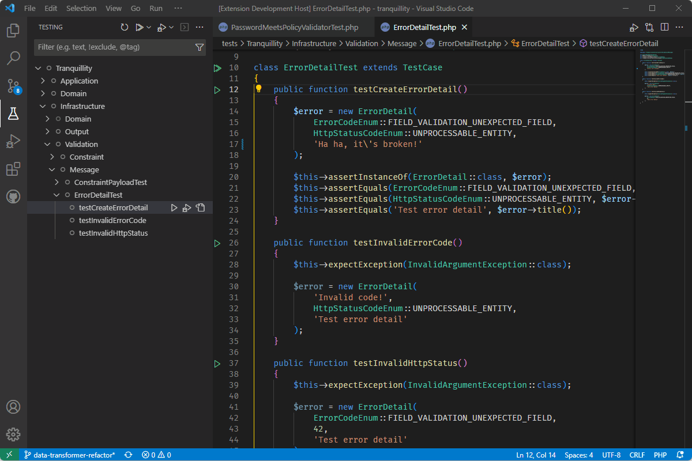
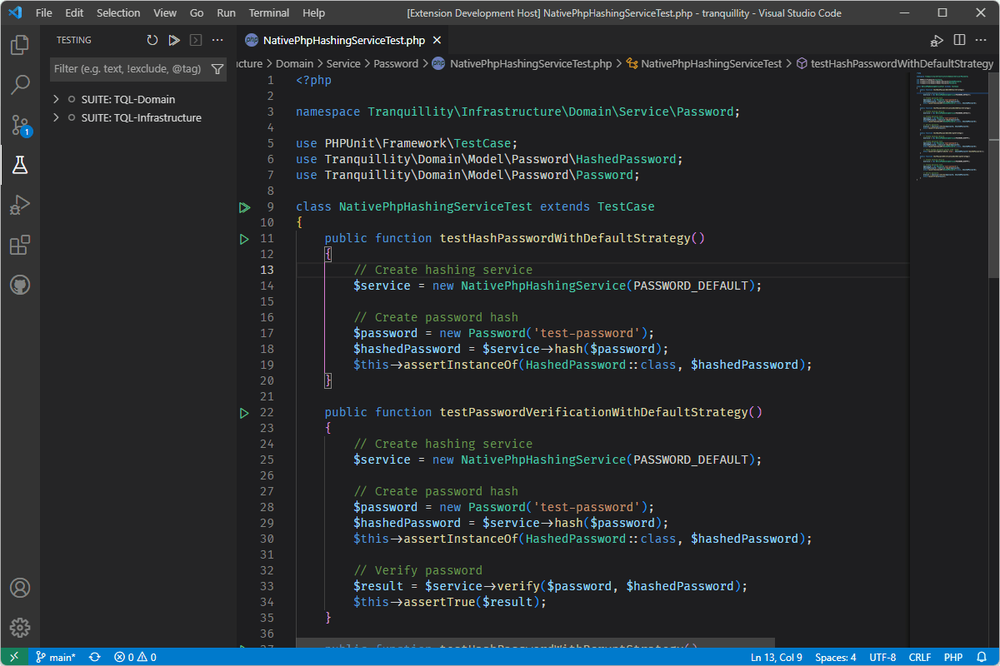

# PHPUnit Test Workbench

An extension to integrate PHPUnit with the native Test Explorer functionality within VS Code. Zero configuration required for common environment setups (i.e. where `php` is in your environment path, and PHPUnit is installed via Composer or included as a PHAR library).

## Features
* Integrates with standard VS Code Test Explorer
* Organise and run your tests:
  * By namespace
  * By test suite (as defined in your `phpunit.xml` configuration file)
  * Simple list of files and methods
* Errors appear as a peek within the editor
* History of test run results and execution times is maintained
* Includes commands and hotkeys to allow quick running of test or test suites

## Requirements
* __PHP:__ Version 7
* __PHPUnit:__ Currently only tested on version 9

>PHP binary and PHPUnit must be installed on the environment where the tests are being run. 
>
>If you are running in a Docker container, WSL or any other remote/virtual environment, this extension will work in conjunction with the [Remote Development](https://marketplace.visualstudio.com/items?itemName=ms-vscode-remote.vscode-remote-extensionpack) extension by Microsoft.

## Commands
|Command|ID|Description|
|-------|--|-----------|
|__PHPUnit: Run test method__|`phpunit-test-workbench.runMethod`|If the cursor is located within a test method, execute only that test method.|
|__PHPUnit: Run test class__|`phpunit-test-workbench.runClass`|If the active editor is for a test class, execute all test methods within the class.|
|__PHPUnit: Run test suite__|`phpunit-test-workbench.runSuite`|Display a dialog allowing the user to select from the list of test suites found in configuration files. All test methods within the class will be executed.|
|__PHPUnit: Run all tests__|`phpunit-test-workbench.runAll`|Run all tests identified in the Test Explorer|

## Configuration options
|Option|Description|
|------|-----------|
|`log.level`|Control the level of information displayed in the output panel.|
|`log.autoDisplayOutput`|Control when to automatically display the Output panel showing log messages. Regardless of this setting, log output can always be viewed by opening the relevant Output panel manually.|
|`php.binaryPath`|Path to the location of the PHP binary. If left blank, it will be assumed that `php` is available via the environment `$PATH` variable.|
|`phpunit.binaryPath`|Path to the location of the PHPUnit binary (either `phpunit` or `phpunit.phar`). If left blank, the following locations will be checked: <li>Composer `vendor` directory</li><li>`phpunit.phar` in the root of the current workspace directory</li>If not found anywhere, it will be assumed that `phpunit.phar` is available via the environment `$PATH` variable.|
|`phpunit.locatorPatternConfigXml`|The glob describing the location of your configuration file (usually named `phpunit.xml`). The default pattern is `phpunit.xml`.|
|`phpunit.testDirectory`|Relative path from the workspace folder root to the directory where tests should be executed from (usually the `tests` folder).|
|`phpunit.testFileSuffix`|Suffix used to identify test files within the test directory. If left blank, PHPUnit default suffixes (`Test.php` and `.phpt`) will be used.|
|`phpunit.testNamespacePrefix`|If using PSR-4 namespaces, use this setting to map your test namespace to the test directory. Default is blank (which assumes the folder structure inside your test directory matches the namespace structure exactly).|
|`phpunit.testOrganization`|Method used to organise and display tests in the Test Explorer:<li>__By file__: Show as a flat list of files, with test methods as children</li><li>__By namespace__: Hierarchical display, organized using the namespace structure (assumes compliance with [PSR-4](https://www.php-fig.org/psr/psr-4/))</li>|
|`phpunit.useTestSuiteDefinitions`|Use test suite definitions within your configuration file to locate and group tests in the Test Explorer. Note that using this option requires a valid PHPUnit configuration file to be found via the `phpunit.locatorPatternConfigXml` glob pattern. Test suite definitions in the configuration file will ignore the `phpunit.testDirectory` setting.|

## Examples
### Test organization

### Group tests by test suite

### Display of failed tests

### Execute tests via commands

## Release notes
### v0.3.2 - 2022-12-02
* __FIXED:__ New test added to Test Explorer on each keystroke instead of on file save ([#42](https://github.com/chiefmyron/phpunit-test-workbench/issues/42))
* __FIXED:__ All test files being reparsed whenever any single test file is saved ([#43](https://github.com/chiefmyron/phpunit-test-workbench/issues/43))

### v0.3.1 - 2022-12-01
* __FIXED:__ Some test failures not correctly detected by results parser ([#40](https://github.com/chiefmyron/phpunit-test-workbench/issues/40))

### v0.3.0 - 2022-11-28
* __NEW:__ Include pertinent information in recorded test run output ([#34](https://github.com/chiefmyron/phpunit-test-workbench/issues/34))
* __NEW:__ Add test debug run profile ([#36](https://github.com/chiefmyron/phpunit-test-workbench/issues/36))
* __NEW:__ Include summary of test run in output ([#38](https://github.com/chiefmyron/phpunit-test-workbench/issues/38))

### v0.2.0 - 2022-10-19
* __NEW:__ Detect tests identified with the `@tests` docblock annotation ([#21](https://github.com/chiefmyron/phpunit-test-workbench/issues/21))
* __NEW:__ Setting to control when Output panel is displayed on test execution ([#25](https://github.com/chiefmyron/phpunit-test-workbench/issues/25))
* __NEW:__ Highlight lines within test methods where test failures occur ([#26](https://github.com/chiefmyron/phpunit-test-workbench/issues/26))
* __NEW:__ Wire up Test Explorer cancel button to actually cancel test run ([#27](https://github.com/chiefmyron/phpunit-test-workbench/issues/27))
* __FIXED:__ Test run icons offset by 1 line from class and method identifiers ([#23](https://github.com/chiefmyron/phpunit-test-workbench/issues/23))
* __FIXED:__ Output from Git editors being parsed for test cases ([#31](https://github.com/chiefmyron/phpunit-test-workbench/issues/31))

### v0.1.3 - 2022-10-17
* __FIXED:__ Clicking the 'Run test' icon in a test class sometimes refreshes the Test Explorer instead of running the test ([#19](https://github.com/chiefmyron/phpunit-test-workbench/issues/19))
* __FIXED:__ Clicking 'Go to test' on a namespace in Test Explorer displays an error ([#17](https://github.com/chiefmyron/phpunit-test-workbench/issues/17))

### v0.1.2 - 2022-10-15
* __FIXED:__ Build error where `xml2js` library was not referenced properly

### v0.1.1 - 2022-10-15
* __FIXED:__ Commands not executing tests for specific classes or methods ([#12](https://github.com/chiefmyron/phpunit-test-workbench/issues/12))
* Updated documentation to include example images

### v0.1.0 - 2022-10-14
* Initial release
